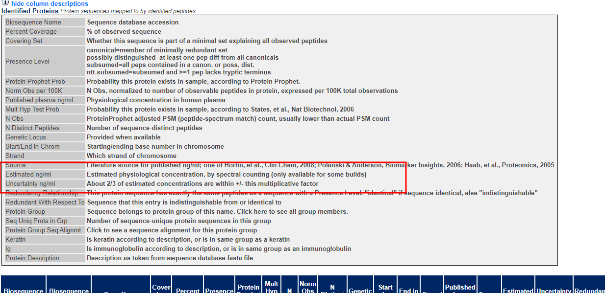

- TODO  整理历史git分支
  SCHEDULED: <2024-04-29 Mon>
- DOING 全转录单独运行LONG的流程
  :LOGBOOK:
  CLOCK: [2024-04-22 Mon 17:23:54]
  :END:
- DONE 跟进基因集打分问题
  :LOGBOOK:
  CLOCK: [2024-04-22 Mon 17:31:19]--[2024-04-23 Tue 08:36:45] =>  15:05:26
  CLOCK: [2024-04-23 Tue 08:36:47]--[2024-04-23 Tue 08:36:49] =>  00:00:02
  CLOCK: [2024-04-23 Tue 08:36:50]--[2024-04-23 Tue 08:36:51] =>  00:00:01
  CLOCK: [2024-04-23 Tue 08:36:55]--[2024-04-23 Tue 08:36:56] =>  00:00:01
  CLOCK: [2024-04-23 Tue 08:37:05]--[2024-04-23 Tue 08:37:08] =>  00:00:03
  :END:
- TODO 沟通磷酸化开发事项
  :LOGBOOK:
  CLOCK: [2024-04-22 Mon 08:30:15]--[2024-04-22 Mon 08:30:16] =>  00:00:01
  CLOCK: [2024-04-22 Mon 08:30:18]--[2024-04-22 Mon 08:30:18] =>  00:00:00
  CLOCK: [2024-04-22 Mon 17:23:58]--[2024-04-23 Tue 08:36:57] =>  15:12:59
  :END:
- TODO 磷酸化导表测试
- TODO sanger 开发维护工具
  DEADLINE: <2024-05-31 Fri>
- TODO  蛋白血浆浓度 https://peptideatlas.org/hupo/hppp/
  :LOGBOOK:
  CLOCK: [2024-04-22 Mon 10:48:18]--[2024-04-22 Mon 10:48:19] =>  00:00:01
  :END:
	- 只有血浆样本可以
	- 
	- 
	- http://bio-bigdata.hrbmu.edu.cn/CellMarker/CellMarker_help.html