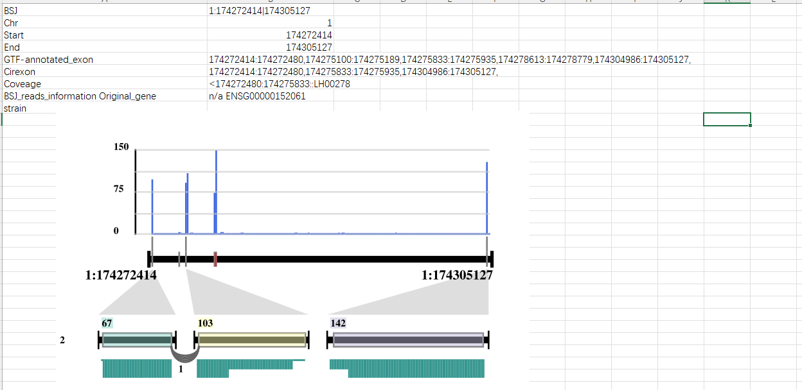
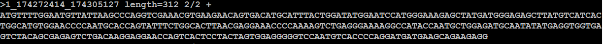

- TODO 磷酸化工作流
- TODO cellchat pathway有网络图没有和弦图
- DONE 全转录组circRNA序列提取 选择circrna  splicing reads比对到的exon连接起来
  :LOGBOOK:
  CLOCK: [2024-04-23 Tue 09:54:50]--[2024-04-24 Wed 09:21:07] =>  23:26:17
  :END:
	- 
	- 
- TODO workflow_logic_parse.py ast_parse_result.py 可以和logseq结合使用么
- TODO 单细胞大样本个性化分析问题
  :LOGBOOK:
  CLOCK: [2024-04-23 Tue 12:33:49]--[2024-04-23 Tue 12:33:50] =>  00:00:01
  CLOCK: [2024-04-23 Tue 12:33:52]--[2024-04-23 Tue 12:33:53] =>  00:00:01
  CLOCK: [2024-04-23 Tue 12:33:59]
  :END:
- DOING 关联分析文件检查
  :LOGBOOK:
  CLOCK: [2024-04-24 Wed 10:06:49]
  :END:
- TODO lncrna wholetrans 添加JASPAR
- DONE  联合分析KEGG分类加速， gsva 取消注释提示
  :LOGBOOK:
  CLOCK: [2024-04-23 Tue 16:33:47]
  CLOCK: [2024-04-23 Tue 16:33:48]--[2024-04-24 Wed 09:21:44] =>  16:47:56
  :END:
-