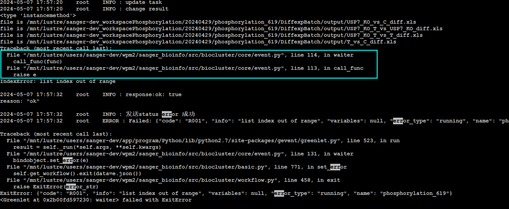

- 静态图
	- https://cn.string-db.org/api/svg/network?identifiers=10090.ENSMUSP00000022616%0d10090.ENSMUSP00000074264%0d10090.ENSMUSP00000095655%0d10090.ENSMUSP00000086565%0d10090.ENSMUSP00000022293%0d10090.ENSMUSP00000100667%0d10090.ENSMUSP00000128914%0d10090.ENSMUSP00000005077%0d10090.ENSMUSP00000033626%0d10090.ENSMUSP00000099835%0d10090.ENSMUSP00000004140%0d10090.ENSMUSP00000099928%0d10090.ENSMUSP00000073462%0d10090.ENSMUSP00000112385%0d10090.ENSMUSP00000088358%0d10090.ENSMUSP00000064479%0d10090.ENSMUSP00000138396&species=10090&network_flavor=confidence&required_score=400
	- https://cn.string-db.org/cgi/help.pl?subpage=api%23retrieving-similarity-scores-of-the-protein-set
	- 表格获取svg改为 tsv-no-header
- NOW 时序分析如何指定纵坐标范围 和曾静对接
  :LOGBOOK:
  CLOCK: [2024-05-09 Thu 08:47:12]
  :END:
- DONE X11 server如何下载 使用vcXsrv解决
-
- 什么情况下不提示错误信息
	- {:height 328, :width 778}