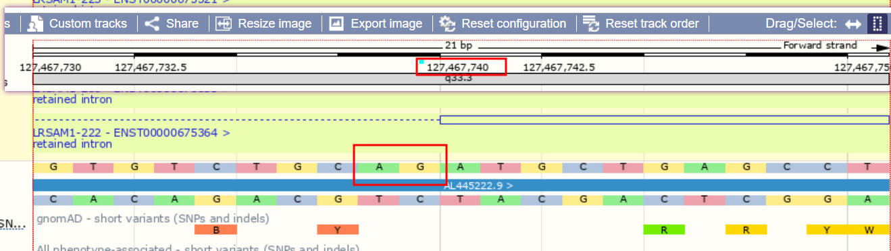

- OCD
	- 1 出门时检查     1， 1
	- 2 买早餐时掏手机    1， 1
	- 3 去@姐姐@家出电梯检查 1， 1
	- 4 充电掏手机检查 2， 1
-
- plsda 置信圈制作comp1 和 comp2两个维度
-
- DONE 修改backsplicing site
- circrna 剪切序列
- 9_127467740_127473931
- {:height 38, :width 778}
- 
- 
- {:height 265, :width 745}
- 9_36197551_36199096
- https://asia.ensembl.org/Homo_sapiens/Location/View?db=core;r=9:36199086-36199106
- 
- {:height 262, :width 778}
- 
- 