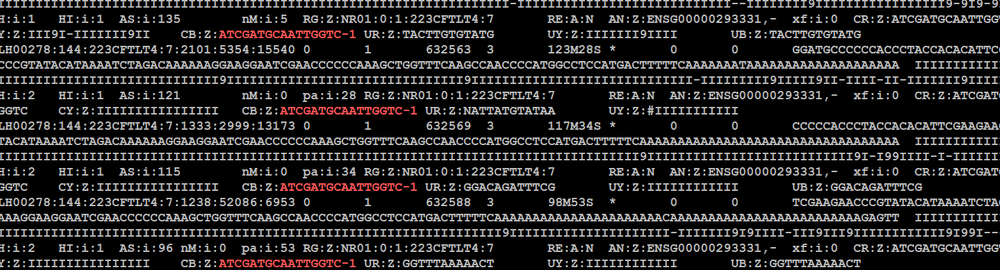
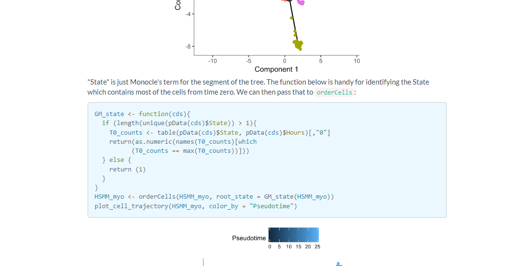

-
	-
	- loom 文件测试
	- ├── cellsorted_possorted_genome_bam.bam
	  ├── cloupe.cloupe
	  ├── filtered_feature_bc_matrix
	  │   ├── barcodes.tsv.gz
	  │   ├── features.tsv.gz
	  │   └── matrix.mtx.gz
	  ├── filtered_feature_bc_matrix.h5
	  ├── metrics_summary.csv
	  ├── molecule_info.h5
	  ├── possorted_genome_bam.bam
	  ├── possorted_genome_bam.bam.bai
	  ├── raw_feature_bc_matrix
	  │   ├── barcodes.tsv.gz
	  │   ├── features.tsv.gz
	  │   └── matrix.mtx.gz
	  ├── raw_feature_bc_matrix.h5
	  └── web_summary.html
- DONE 全转录kegg图片错误
  :LOGBOOK:
  CLOCK: [2024-05-15 Wed 11:31:21]--[2024-05-27 Mon 08:16:16] =>  284:44:55
  :END:
- loom文件
- {:height 218, :width 778}
-
-
- monocle指定根节点 https://cole-trapnell-lab.github.io/monocle-release/docs/
- 