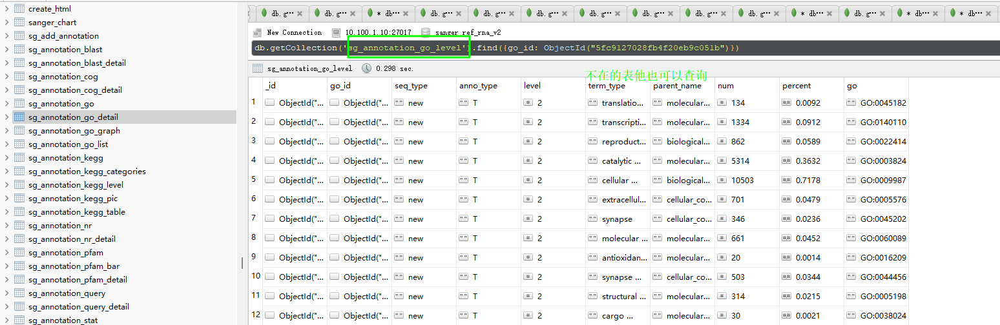
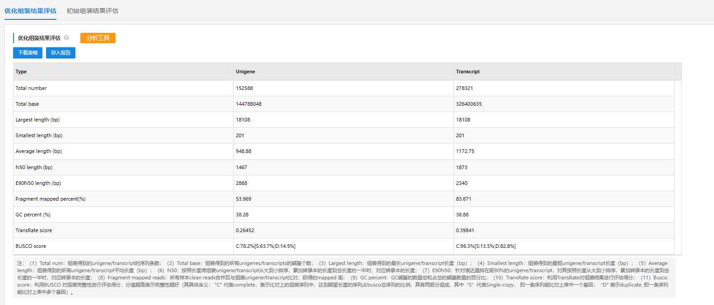
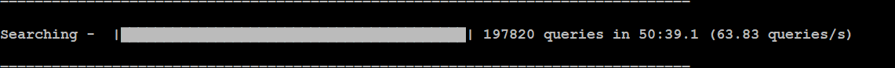

- mongo 转动态卡死 /mnt/lustre/sanger_workspaceMongo/20240517/Transfer_mongotransfer.ref_rna_v2.majorbio_292544/MongoBack2dydb
	- 
- DOING omark调研 https://www.nature.com/articles/s41587-024-02147-w
  :LOGBOOK:
  CLOCK: [2024-05-20 Mon 08:24:10]
  :END:
	- https://www.nature.com/articles/s41587-024-02147-w
	- https://omabrowser.org/oma/current/
	- 烟草项目 
	- 
- 无标签网页版报告开发
  SCHEDULED: <2024-05-22 Wed>
	- 参考文献为空的问题解决
- 静态转动态检查错误， 不一致后抛出错误
  SCHEDULED: <2024-05-23 Thu>
- 蛋白选错物种提示
	- /mnt/ilustre/isanger_workspaceDia4D/20240516/Dia4DMedical_m56p_h3gk6v0jrfph18kop7i7ce
	  id:: 6646b335-e4ff-4b4c-8f40-8f402b278036
-