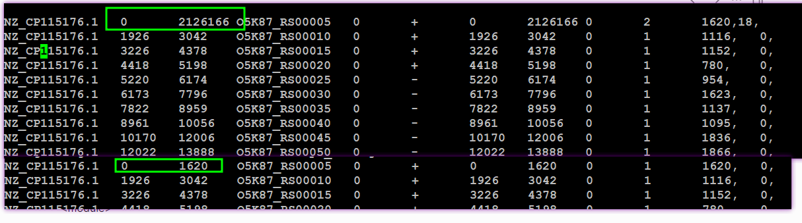

- NOW 细分项目
  SCHEDULED: <2024-06-14 Fri>
  :LOGBOOK:
  CLOCK: [2024-06-03 Mon 11:25:31]--[2024-06-03 Mon 11:25:31] =>  00:00:00
  CLOCK: [2024-06-03 Mon 11:25:32]--[2024-06-03 Mon 11:25:33] =>  00:00:01
  CLOCK: [2024-06-03 Mon 11:25:33]--[2024-06-03 Mon 11:25:38] =>  00:00:05
  CLOCK: [2024-06-03 Mon 11:25:41]
  :END:
	- 新分类KO对应
	- TODO 数据导入mongo
	- 匹配基因时如果没有ko则匹配gene name
- 原核首尾相接 2024-05-24 20:49:20.375005      运行开始
  processing /mnt/lustre/sanger_workspaceProkRna/20240524/Prokrna_tg76_kku8gott1ab6hth1fho677/FileCheck/reshape_exon.gtf.filter.bed ...Traceback (most recent call last):
    File "/mnt/lustre/users/sanger/app/program/Python/bin/read_distribution_modify.py", line 306, in <module>
  
    File "/mnt/lustre/users/sanger/app/program/Python/bin/read_distribution_modify.py", line 81, in process_gene_model
      intron = BED.unionBed3(intron)
    File "/mnt/lustre/users/sanger/app/program/Python/lib/python2.7/site-packages/qcmodule/BED.py", line 2522, in unionBed3
      bitsets = binned_bitsets_from_list(lst)
    File "/mnt/lustre/users/sanger/app/program/Python/lib/python2.7/site-packages/bx/bitset_builders.py", line 143, in binned_bitsets_from_list
      last_bitset.set_range( start, end - start )
    File "lib/bx/bitset.pyx", line 216, in bx.bitset.BinnedBitSet.set_range
    File "lib/bx/bitset.pyx", line 186, in bx.bitset.bb_check_range_count
  IndexError: Count (-1) must be non-negative.
  2024-05-24 20:49:23.400290      运行结束，运行时长:3s,exitcode:1
	- 
-
- TODO  KEGG物种出错/mnt/lustre/sanger_workspaceProteinRna/20240527/ProteinRna_v8th_ifmk1tuo0r6np1395e6ul1/PrProteinsetAnnot/PrKeggClass/KeggClass