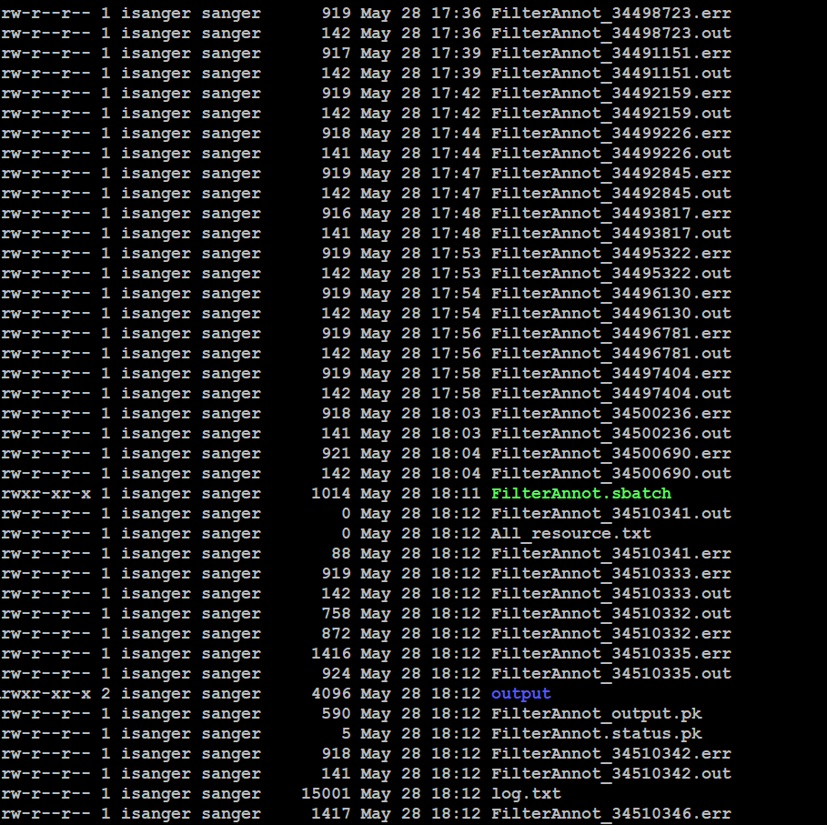

- pupteer 内存占用高可以尝试使用docker解决
	- https://stackoverflow.com/questions/48263765/how-to-set-shm-size-configuration-for-puppeteer
	- https://www.volcengine.com/theme/4705243-P-7-1
- 出现tool多次重复运行的情况
	- 
- markdown 单个文件过大时可能会把vscode的插件卡死， 使得copilot一直循环