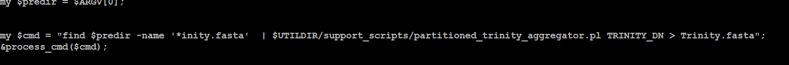

- Trinity merge 总是被杀掉和流程中调用、bash有关？
	- 
- TODO 医学版报告有没有客户信息？ sch
  SCHEDULED: <2024-06-21 Fri>
-
- 工作流生成的报告会重运行一次
	- {
	      "_id" : ObjectId("6679a38bba8d1f80297b33f0"),
	      "workflow_report_keep_time" : 0,
	      "created_ts" : "2024-06-25 00:49:14",
	      "interaction_report" : false,
	      "workflow_no_logo_report_avail" : true,
	      "task_id" : "53kb_rcttsi7r2qd93bpjtlbkig",
	      "interaction_report_total_path" : null,
	      "workflow_report_total_path" : null,
	      "interaction_report_keep_time" : 0,
	      "interaction_report_num" : 0,
	      "s3_delete_status" : false,
	      "s3_delete_sn" : null,
	      "project_sn" : "hrjhj1gqfpo3g6um0jd84sfsol",
	      "interaction_report_avail" : false,
	      "project_type" : "ref_rna_v2",
	      "interaction_report_part_path" : null,
	      "interaction_report_time" : null,
	      "workflow_report_avail" : true,
	      "workflow_report_part_path" : null,
	      "workflow_report" : true,
	      "workflow_report_time" : 0,
	      "workflow_no_logo_report_part_path" : "s3nb3://refrnav2/files/m_219/hrjhj1gqfpo3g6um0jd84sfsol/53kb_rcttsi7r2qd93bpjtlbkig/workflow_results/HTML_report_workflow_no_logo.zip",
	      "workflow_no_logo_report_time" : "2024-06-25 00:49:15",
	      "workflow_no_logo_report_total_path" : "s3nb3://refrnav2/files/m_219/hrjhj1gqfpo3g6um0jd84sfsol/53kb_rcttsi7r2qd93bpjtlbkig/workflow_results/"
	  }
-