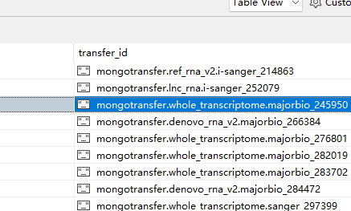

- 1、未同步完成
	- /mnt/lustre/sanger_workspaceMongo/20240702/Transfer_mongotransfer.ref_rna_v2.i-sanger_214863   删除
	- /mnt/ilustre/isanger_workspaceMongo/20240702/Transfer_mongotransfer.whole_transcriptome.majorbio_245950
	- /mnt/ilustre/isanger_workspaceMongo/20240702/Transfer_mongotransfer.whole_transcriptome.majorbio_276801
	- /mnt/lustre/sanger_workspaceMongo/20240702/Transfer_mongotransfer.whole_transcriptome.sanger_297399
	- /mnt/lustre/sanger_workspaceMongo/20240702/Transfer_mongotransfer.denovo_rna_v2.majorbio_284472
	- /mnt/lustre/sanger_workspaceMongo/20240702/Transfer_mongotransfer.whole_transcriptome.majorbio_282019
	- /mnt/lustre/sanger_workspaceMongo/20240702/Transfer_mongotransfer.denovo_rna_v2.majorbio_266384
	- /mnt/ilustre/isanger_workspaceMongo/20240702/Transfer_mongotransfer.whole_transcriptome.majorbio_283702
	- 
	- MongoBack2dydb_39095022.err
	-
-
- 2、2024-07-03T13:51:52.377+0800    connected to: mongodb://[**REDACTED**]@10.11.16.69:27017/sanger_whole_transcriptome?authMechanism=SCRAM-SHA-1
  2024-07-03T13:51:52.378+0800    Failed: invalid JSON input. Position: 141. Character: N
  2024-07-03T13:51:52.378+0800    0 document(s) imported successfully. 0 document(s) failed to import.