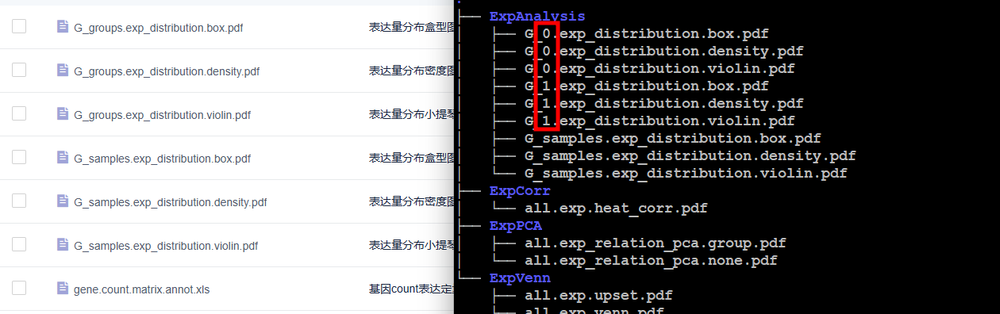
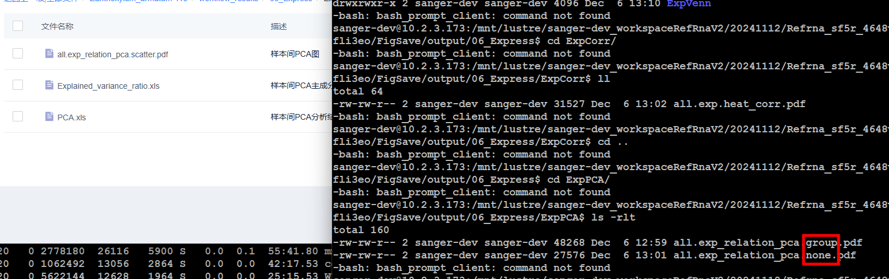
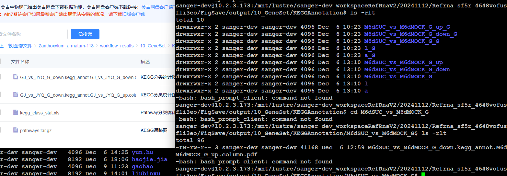
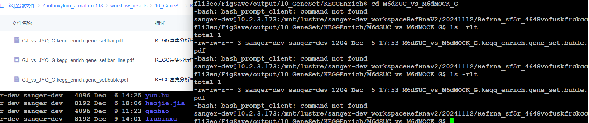

- TODO  logseq如何启动urlschema she
  SCHEDULED: <2025-01-24 Fri ++1w>
- DONE 有参的项目图片存入
  SCHEDULED: <2024-12-10 Tue .+1d>
	- /home/liubinxu/work/test/test2/html 本地测试 如果图片没有则是docker的问题 一般更新版本解决
	- [[存图流程]]
	- 02_QC/qc_pdf  目录压缩
	- 03_Align/QualityAssessment/align_pdf 目录压缩
	- 04_Assemble   all.assemble_len.column.pdf new.assemble_relation_g2t.columns.pdf 图片缺少
	- 05_Annotation/AnnotStatistics annot_gene_stat_exp.column.pdf 图片缺少
	- 06_Express文件名错误
	- 
-
	- pca 文件名错误
	- 
	-
	- 08 09 缺少图片
	- kegg文件多出目录
	- 
	-
	- kegg 富集缺少类型
	- 
	-