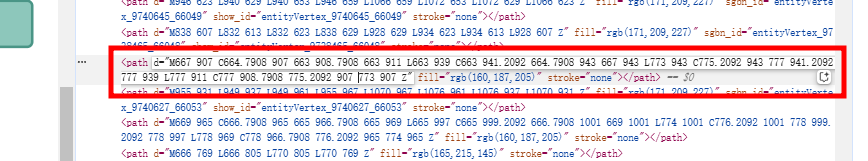

- reactome  图片svg中找不到位置
- https://reactome.org/PathwayBrowser/#/R-MMU-2022090&SEL=R-MMU-2192759
- 没有加入show_id  entityVertex_9740623_66051
- 9740627
- https://reactome.org/PathwayBrowser/#/R-MMU-2022090&SEL=R-MMU-2220795&FLG=R-MMU-2192759&FLGINT
- R-MMU-2220797   R-MMU-2220795 R-MMU-2192759
- 9874170
- 
-
-
- pathway 1474290  0       1650814
- 1474244 0       1474290 'Pathway'
  1474290 0       1650814 'Pathway'
  1474290 1       2022090 'Pathway
-
-
- sgbn   9740623 Collagen type XII, XIV fibrils
	- 9740627 Collagen type I,II:XII,XIV fibrils
- seurat v5 安装
	- /mnt/lustre/sanger1_workspaceScrna/20241210/CelltypeVisualizationV2_h0q2_83i0a5firjdb24mnfth06u_1210093903152661_5418
	-
- scenic sketch
  /mnt/ilustre/isanger_workspaceScrna/20241210/Scenic_cthn_rbnsklsi0gehbisfiub9gd_1210163346005708_2056
-
-
- /mnt/ilustre/isanger_workspaceScrna/20241211/Scina_3f90_alhnh9an78buaqsscfuf25_1211123833619637_7560/Scina